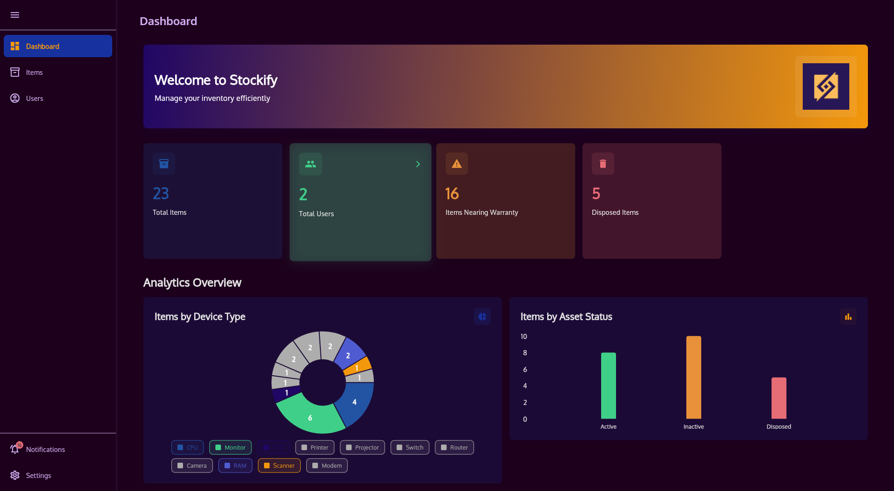
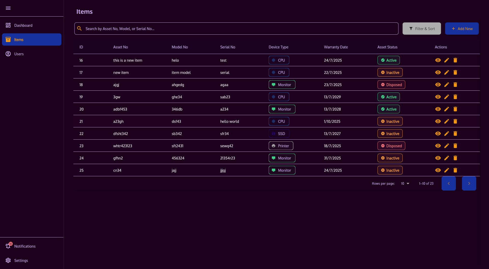
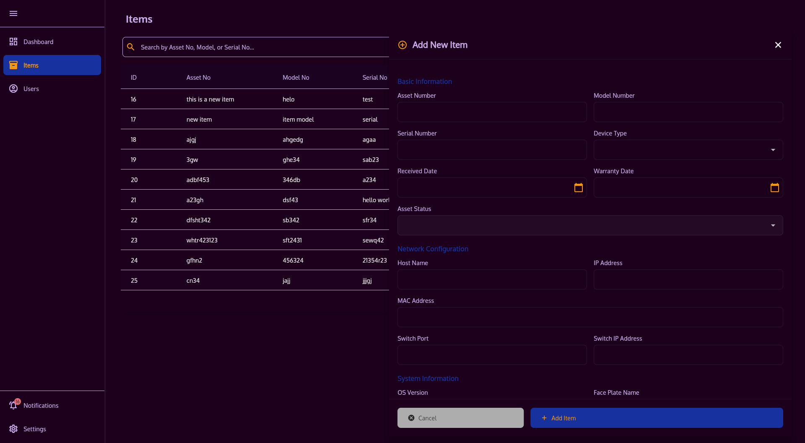
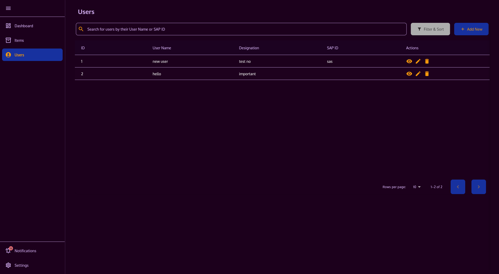
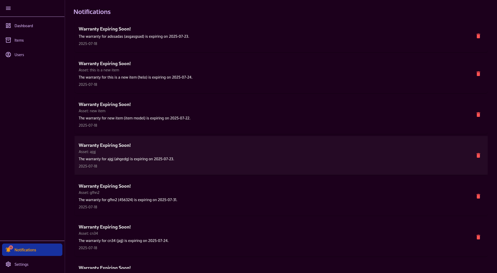

# Stockify: Inventory Management System


A robust and intuitive desktop application designed for efficient inventory and user management. Stockify helps businesses and individuals keep track of their assets, manage user assignments, and generate comprehensive reports with ease.

## Table of Contents

- [Stockify: Inventory Management System](#stockify-inventory-management-system)
	- [Table of Contents](#table-of-contents)
	- [Features](#features)
	- [Screenshots](#screenshots)
		- [Dashboard](#dashboard)
		- [Inventory Management](#inventory-management)
		- [Add to Inventory](#add-to-inventory)
		- [User Management](#user-management)
		- [Notifications](#notifications)
	- [Technologies Used](#technologies-used)
	- [Getting Started](#getting-started)
		- [Prerequisites](#prerequisites)
		- [Installation](#installation)
		- [Running the Application](#running-the-application)
	- [Usage](#usage)
	- [Project Structure](#project-structure)
	- [Contributing](#contributing)
	- [License](#license)
	- [Contact](#contact)

## Features

- **Comprehensive Item Management:**
  - Add, view, edit, and delete inventory items with detailed attributes (Asset No, Model No, Serial No, Device Type, Received Date, Warranty Date, Asset Status, Host Name, IP/Port, MAC Address, OS Version, Face Plate Name, Switch Port, Switch IP Address, Password Protection, Assigned User).
  - Filter and sort items by various criteria (Device Type, Asset Status, Warranty Date, etc.).
  - Search for items by Asset No, Model No, or Serial No.
- **User Management:**
  - Maintain a database of users with details like User Name, Designation, SAP ID, IP Phone, Room No, and Floor.
  - Filter and search users by User Name or SAP ID.
- **Data Import & Export:**
  - Import inventory data from CSV and Excel files.
  - Export inventory data to CSV and Excel files for external analysis or backup.
- **Reporting:**
  - Generate detailed PDF reports summarizing inventory, including breakdowns by device type and asset status.
- **Notifications:**
  - Receive timely notifications for items nearing their warranty expiry date.
- **Intuitive User Interface:**
  - Modern and responsive design built with Flutter, adapting to various screen sizes.
  - Supports both light and dark themes.
  - Integrated keyboard shortcuts for quick navigation and actions.
- **Cross-Platform Desktop Application:**
  - Available for Windows, macOS, and Linux.

## Screenshots

### Dashboard


### Inventory Management


### Add to Inventory


### User Management


### Notifications


## Technologies Used

- **Frontend:**
  - [Flutter](https://flutter.dev/): UI Toolkit for building natively compiled applications for mobile, web, and desktop from a single codebase.
  - [Dart](https://dart.dev/): Programming language for Flutter.
  - [FFI (Foreign Function Interface)](https://dart.dev/guides/libraries/c-interop): For seamless communication with the Go backend.
- **Backend:**
  - [Go (Golang)](https://go.dev/): High-performance backend for data persistence and business logic.
  - [GORM](https://gorm.io/): ORM library for Go.
  - [SQLite](https://www.sqlite.org/): Lightweight, file-based database for local data storage.

## Getting Started

Follow these instructions to set up and run Stockify on your local machine.

### Prerequisites

Before you begin, ensure you have the following installed:

- [Git](https://git-scm.com/book/en/v2/Getting-Started-Installing-Git)
- [Flutter SDK](https://flutter.dev/docs/get-started/install) (Stable channel recommended)
- [Go](https://go.dev/doc/install) (Version 1.20 or higher recommended)

### Installation

1.  **Clone the repository:**
    ```bash
    git clone https://github.com/defusername/Stockify.git
    cd Stockify
    ```

2.  **Build the Go Backend:**
    Navigate to the Go backend directory and build the shared library for your operating system.

    ```bash
    cd stockify_backend_golang
    ```

    -   **For Windows:**
        ```bash
        go build -buildmode=c-shared -o inventory.dll src/main.go
        ```
        Copy `inventory.dll` to `../stockify_app_flutter/lib/`.
    -   **For Linux:**
        ```bash
        go build -buildmode=c-shared -o libinventory.so src/main.go
        ```
        Copy `libinventory.so` to `../stockify_app_flutter/lib/`.
    -   **For macOS:**
        ```bash
        go build -buildmode=c-shared -o libinventory.dylib src/main.go
        ```
        Copy `libinventory.dylib` to `../stockify_app_flutter/lib/`.

    After building, navigate back to the root of the `Stockify` project.

3.  **Install Flutter Dependencies:**
    Navigate to the Flutter application directory and get the dependencies.

    ```bash
    cd ../stockify_app_flutter
    flutter pub get
    ```

### Running the Application

From the `stockify_app_flutter` directory, run the application:

```bash
flutter run -d <platform>
```
Replace `<platform>` with `windows`, `macos`, or `linux` depending on your operating system.

Example for Linux:
```bash
flutter run -d linux
```

## Usage

Upon launching Stockify, you will be presented with a dashboard providing an overview of your inventory.

-   **Navigation:** Use the sidebar to navigate between Dashboard, Items, Users, Notifications, and Settings.
-   **Items:** Add new items, view details, edit existing entries, or delete them. Utilize the search and filter options to quickly find specific items.
-   **Users:** Manage user profiles, which can be assigned to inventory items.
-   **Settings:** Configure application settings, including theme preferences, and perform data import/export operations.
-   **Reports:** Generate PDF reports from the Settings section to get a printable summary of your inventory.

## Project Structure

The project is organized into two main directories:

-   `stockify_app_flutter/`: Contains the Flutter desktop application, responsible for the user interface and interaction.
-   `stockify_backend_golang/`: Contains the Go backend, handling data persistence (SQLite) and business logic, exposed via FFI to the Flutter app.

## Contributing

Contributions are welcome! If you have suggestions for improvements or new features, please open an issue or submit a pull request.

## License

This project is licensed under the MIT License - see the [LICENSE](LICENSE) file for details.

## Contact

For any questions or inquiries, please contact 📧 moshiur.r.nafi@gmail.com.